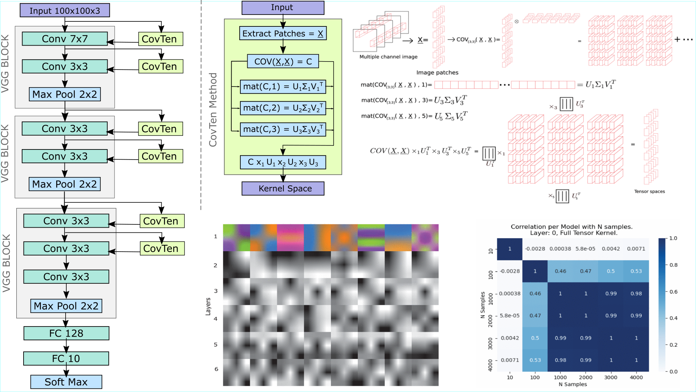

# Covariance Tensor for Convolutional Neural Network

This work introduces a new algorithm based on multilinear algebra for feature extraction, which later is plugged into a CNN to perform classification. During a single feed-forward step, we generate the kernels for a CNN architecture by computing the covariance tensor of the data and factorizing it by Tucker decomposition.

* [Research article IEEE Access (Open Access)](https://ieeexplore.ieee.org/document/9416639)
* Medium Blog: [https://oscar-guarnizo.medium.com/review-covariance-tensor-for-convolutional-neural-networks-77c119f2a225](https://oscar-guarnizo.medium.com/review-covariance-tensor-for-convolutional-neural-networks-77c119f2a225)
* Research poster - EEML 2022: [https://www.researchgate.net/publication/361880577_Poster_Convolutional_Neural_Network_Feature_Extraction_Using_Covariance_Tensor_Decomposition](https://www.researchgate.net/publication/361880577_Poster_Convolutional_Neural_Network_Feature_Extraction_Using_Covariance_Tensor_Decomposition)
* GitLab version: [https://gitlab.com/ricciclope/tensor](https://gitlab.com/ricciclope/tensor)
* For more information: [https://zosov.github.io/portfolio/tensor_decomposition/](https://zosov.github.io/portfolio/tensor_decomposition/)



## Release

* We only released one of our best models for practice purposes and extended work. You can find it here: [baselines/best_model.py](./baselines/best_model.py)
* The covariance tensor computation and tensor decomposition was programmed in C++, using libraries `eigen3` and `opencv`. You can find the implementation here: [filter_extract_lib/](./filter_extract_lib/).
* The coupling between the tensor computation in C++ and the neural network in TensorFlow was programmed in [model/covariance_layer.py](./model/covariance_layer.py). Also, we include some model utils here: [model/model_utils.py](./model/model_utils.py)
* There are some `similarity***.py` scripts in the base folder, which were used to get relevant results.
* Some additional utils snippet codes (for visualization, transformation and other purposes) were programmed here: [utils/](./utils/)

## Installation

Install opencv and eigen library

```
apt install libopencv-dev
apt install libeigen3-dev
```

Compile a new `libtensorfilters.so` if it is needed. Go to the folder `filter_extract_lib`

```
make clean
make
```

Create and environment and install the needed packages using conda environment.

```bash
conda env create -f environment.yml
```

Or if your a using a pip environment use the requirements.txt
```bash
pip install -r requirements.txt
```

